# Platform Architecture

## System Overview

The Poseidon Platform implements a **service-oriented architecture** designed for enterprise scalability, developer productivity, and operational excellence. The platform demonstrates modern distributed systems patterns while maintaining simplicity and reliability.

## High-Level Architecture

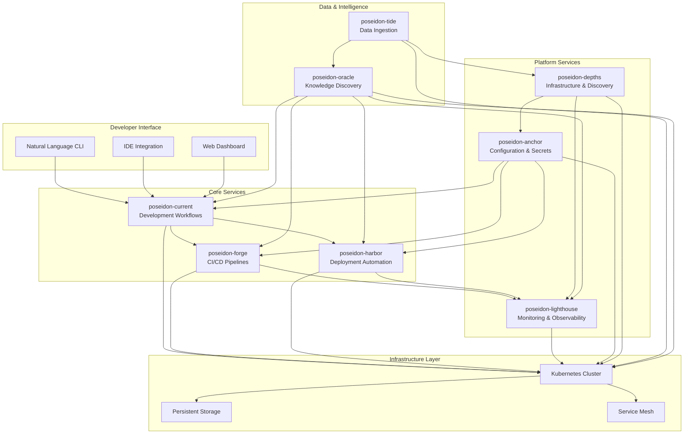

## Service Architecture Patterns

### Service Design Principles

**Single Responsibility**

- Each service owns one functional domain
- Clear boundaries between service capabilities
- Minimal coupling through well-defined APIs

**Independent Deployment**

- Services deployable without coordination
- Containerized with standardized tooling
- Version management and backward compatibility

**Operational Excellence**

- Health monitoring and observability built-in
- Graceful degradation and error handling
- Performance monitoring and optimization

### Service Communication Patterns

**Synchronous Communication**
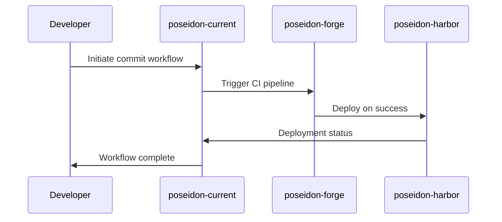

**Asynchronous Communication**
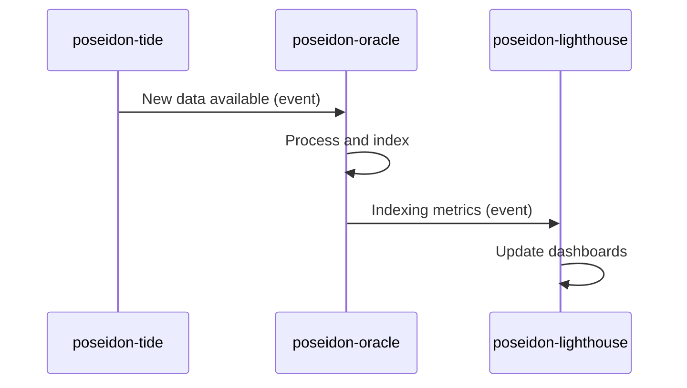

**Event-Driven Workflows**

- Service state changes published as events
- Loose coupling through event subscriptions
- Eventual consistency with compensation patterns

## Core Services Architecture

### **poseidon-current**: Development Workflows

**Architecture Pattern**: Event-driven automation with AI integration

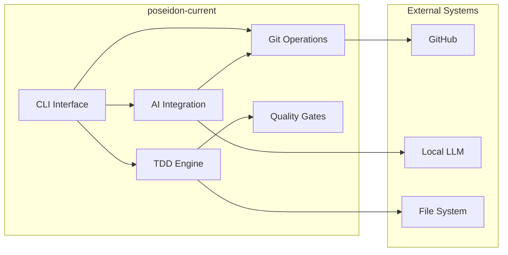

**Key Capabilities**:

- Real-time test execution with 2-3 second feedback
- Local AI-powered commit message generation
- Comprehensive quality gates with pre-commit validation
- Natural language CLI interface

**Technology Stack**:

- **Language**: Python 3.11+
- **Testing**: pytest with file watching
- **AI**: Local LLM with ONNX runtime
- **Quality**: black, flake8, bandit, safety
- **Automation**: Task with watchexec

### **poseidon-forge**: CI/CD Pipelines

**Architecture Pattern**: Pipeline orchestration with quality gates

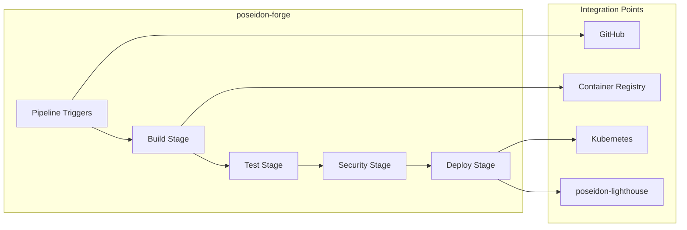

**Key Capabilities**:

- Multi-stage pipeline execution
- Parallel test and security scanning
- Automated deployment coordination
- Quality gate enforcement

### **poseidon-harbor**: Deployment Automation

**Architecture Pattern**: Declarative deployment with rollback capabilities

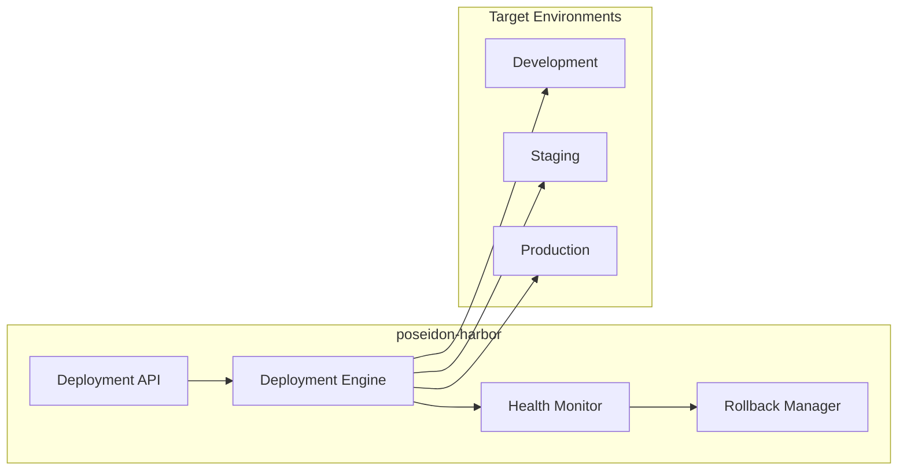

**Key Capabilities**:

- Zero-downtime deployments
- Automated health checking
- Intelligent rollback strategies
- Multi-environment coordination

## Platform Services Architecture

### **poseidon-lighthouse**: Monitoring & Observability

**Architecture Pattern**: Centralized observability with distributed collection

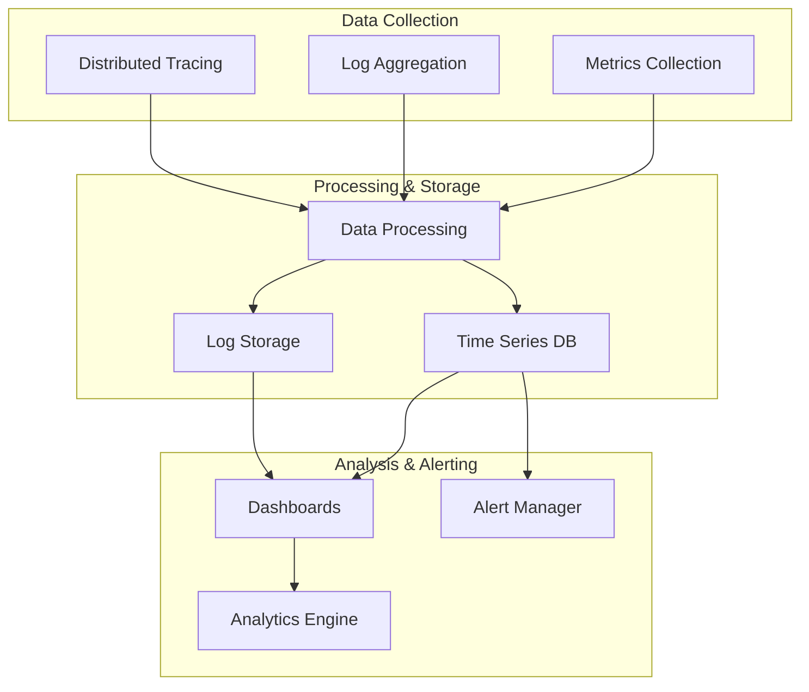

**Key Capabilities**:

- Real-time platform health monitoring
- Distributed tracing across services
- Intelligent alerting with correlation
- Performance analytics and trending

### **poseidon-anchor**: Configuration & Secrets

**Architecture Pattern**: Centralized configuration with distributed caching

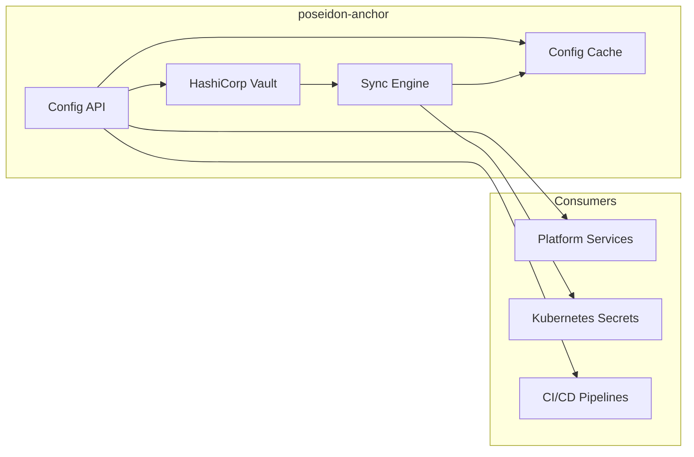

**Key Capabilities**:

- Centralized secrets management with Vault
- Environment-specific configuration
- Automatic secret rotation
- Audit logging and compliance

### **poseidon-depths**: Infrastructure & Service Discovery

**Architecture Pattern**: Service mesh with intelligent discovery

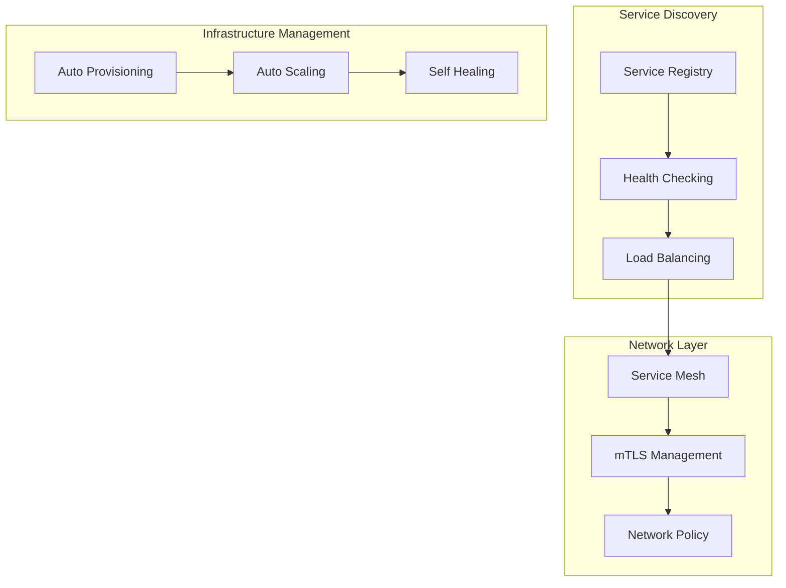

**Key Capabilities**:

- Automatic service discovery with Consul
- Intelligent load balancing
- mTLS encryption for service communication
- Infrastructure auto-scaling and self-healing

## Data & Intelligence Architecture

### **poseidon-tide**: Data Ingestion Workflows

**Architecture Pattern**: Stream processing with intelligent routing

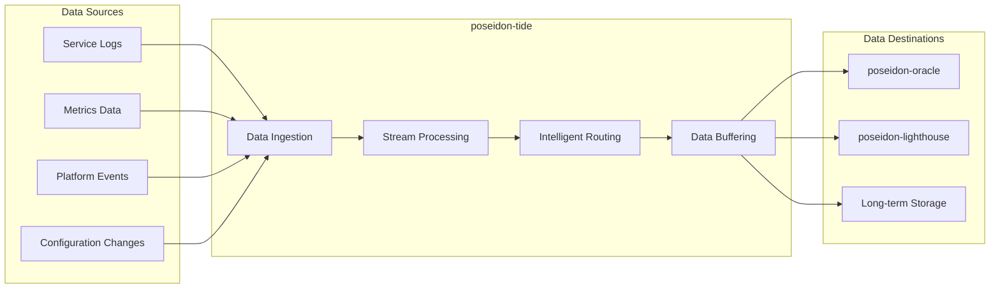

**Key Capabilities**:

- Real-time data stream processing
- Intelligent data classification and routing
- Scalable buffering and backpressure handling
- Data quality validation and enrichment

### **poseidon-oracle**: Knowledge Discovery & RAG

**Architecture Pattern**: Vector search with intelligent retrieval

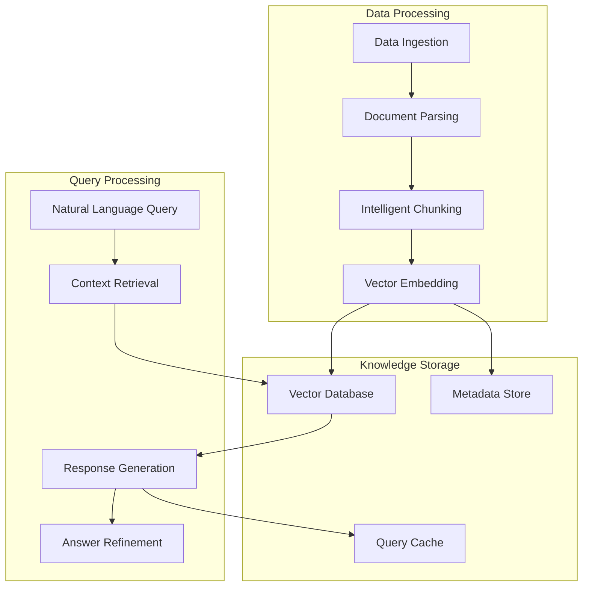

**Key Capabilities**:

- Platform-wide knowledge indexing
- Natural language query interface
- Contextual information retrieval
- Intelligent answer generation with citations

## Cross-Cutting Concerns

### Security Architecture

**Security-by-Design Principles**
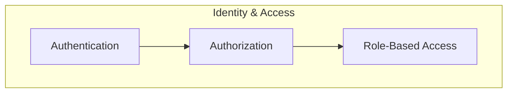

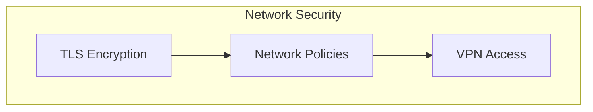

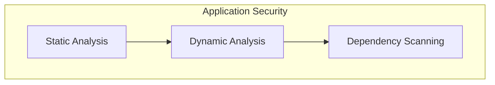

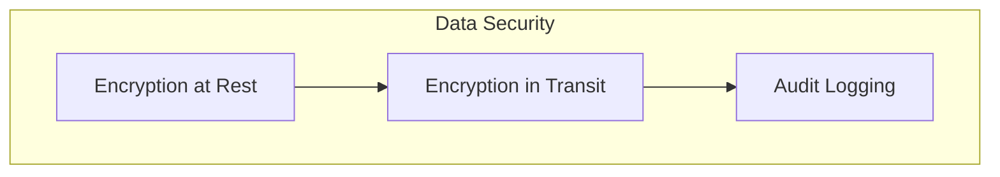

**Security Implementation**:

- **Identity Management**: OAuth 2.0 with RBAC
- **Network Security**: mTLS with service mesh
- **Application Security**: Integrated SAST/DAST scanning
- **Data Protection**: Encryption at rest and in transit
- **Compliance**: Comprehensive audit logging

### Performance Architecture

**Performance Optimization Strategies**

- **Caching**: Multi-layer caching with intelligent invalidation
- **Load Balancing**: Intelligent routing with health-aware balancing
- **Auto-scaling**: Horizontal and vertical scaling based on metrics
- **Resource Management**: Efficient resource allocation and monitoring

**Performance Targets**:

- **API Response Time**: <100ms for 95th percentile
- **Service Discovery**: <10ms service lookup time
- **Deployment Time**: <5 minutes for standard deployments
- **Recovery Time**: <30 seconds for service health restoration

### Reliability Patterns

**High Availability Design**
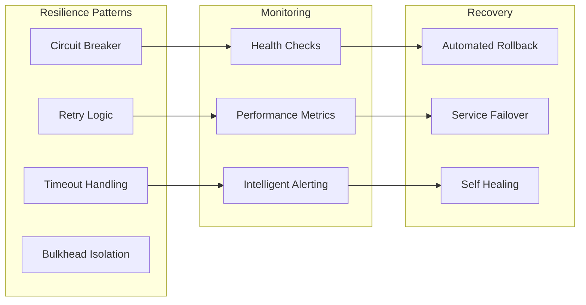

**Reliability Implementation**:

- **Circuit Breakers**: Prevent cascade failures
- **Retry Logic**: Intelligent retry with exponential backoff
- **Health Monitoring**: Comprehensive health checking
- **Graceful Degradation**: Fallback capabilities for all services

## Deployment Architecture

### Container Orchestration

**Kubernetes-Native Design**
```yaml
# Standard deployment pattern for all services
apiVersion: apps/v1
kind: Deployment
metadata:
  name: poseidon-service
  labels:
    app: poseidon-service
    tier: platform
spec:
  replicas: 3
  selector:
    matchLabels:
      app: poseidon-service
  template:
    spec:
      containers:
      - name: service
        image: poseidon/service:latest
        ports:
        - containerPort: 8000
        resources:
          requests:
            memory: "64Mi"
            cpu: "50m"
          limits:
            memory: "256Mi"
            cpu: "200m"
        livenessProbe:
          httpGet:
            path: /health
            port: 8000
        readinessProbe:
          httpGet:
            path: /ready
            port: 8000
```

**Infrastructure Components**:

- **Container Runtime**: Docker with multi-stage builds
- **Orchestration**: Kubernetes with custom operators
- **Service Mesh**: Istio for traffic management
- **Storage**: Persistent volumes with backup strategies
- **Networking**: CNI with network policies

### Environment Strategy

**Multi-Environment Pipeline**
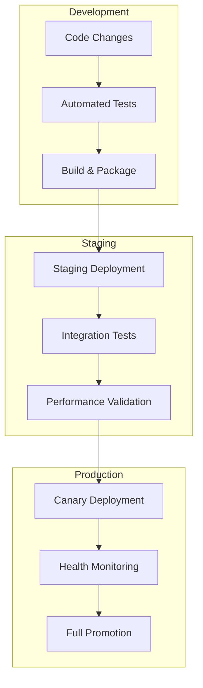

**Environment Characteristics**:

- **Development**: Local containerized environment with file watching
- **Staging**: Production-like environment with full integration testing
- **Production**: High-availability deployment with monitoring and alerting

## Scalability Architecture

### Horizontal Scaling Strategy

**Service Scaling Patterns**

- **Stateless Services**: Horizontal pod autoscaling based on CPU/memory
- **Stateful Services**: Careful scaling with data consistency considerations
- **Background Processing**: Queue-based scaling with worker pools
- **Data Services**: Sharding and replication strategies

**Performance Monitoring**
```python
# Automatic scaling triggers based on performance metrics
scaling_policies = {
    'poseidon-current': {
        'cpu_threshold': 70,
        'memory_threshold': 80,
        'response_time_threshold': 200,  # ms
        'min_replicas': 2,
        'max_replicas': 10
    },
    'poseidon-oracle': {
        'cpu_threshold': 60,
        'memory_threshold': 70,
        'query_latency_threshold': 500,  # ms
        'min_replicas': 3,
        'max_replicas': 20
    }
}
```

### Data Architecture Scalability

**Data Distribution Strategy**

- **Time-Series Data**: Partitioning by time windows
- **Configuration Data**: Replicated across regions
- **Knowledge Data**: Distributed vector search with sharding
- **Audit Data**: Long-term archival with queryable indices

## Technology Stack

### Core Technologies

**Development**

- **Languages**: Python 3.11+, Go (for performance-critical services)
- **Frameworks**: FastAPI, Pydantic, asyncio
- **Testing**: pytest, coverage, mutation testing
- **Quality**: black, flake8, bandit, safety, mypy

**Infrastructure**

- **Container**: Docker with multi-stage builds
- **Orchestration**: Kubernetes with custom operators
- **Service Mesh**: Istio for traffic management
- **Storage**: PostgreSQL, Redis, MinIO
- **Monitoring**: Prometheus, Grafana, Tempo, Alloy, Mimir

**AI & Data**

- **Local AI**: ONNX Runtime, transformers
- **Vector Search**: Weaviate or Qdrant
- **Stream Processing**: Apache Kafka, Redis Streams
- **Analytics**: ClickHouse for high-performance analytics

### Tool Integration

**Development Tools**

- **Automation**: Task for standardized workflows
- **File Watching**: watchexec for real-time feedback
- **Pre-commit**: Comprehensive quality gates
- **Local Development**: Docker Compose for service orchestration

**CI/CD Tools**

- **Version Control**: Git with GitHub integration
- **CI/CD**: GitHub Actions with custom workflows
- **Security**: Integrated SAST/DAST scanning
- **Deployment**: GitOps with ArgoCD

## Future Architecture Evolution

### Planned Enhancements

**Advanced AI Integration**

- Enhanced local model capabilities
- Federated learning across platform instances
- Intelligent automation and optimization

**Multi-Cloud Strategy**

- Cloud-agnostic deployment patterns
- Cross-cloud failover capabilities
- Edge computing integration

**Advanced Analytics**

- Real-time platform analytics
- Predictive scaling and optimization
- Business intelligence integration

---

**Architecture Philosophy**: The Poseidon Platform architecture balances complexity and simplicity, providing enterprise-grade capabilities while maintaining developer productivity and operational excellence through intelligent automation and modern cloud-native patterns.


