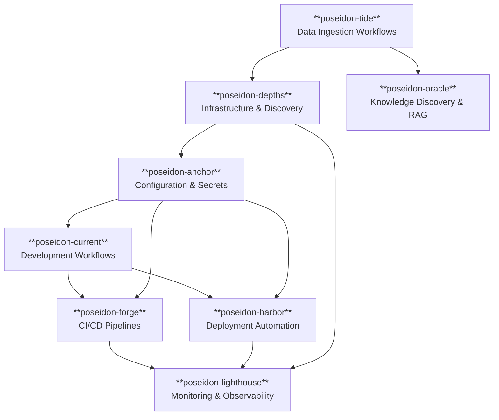

# Platform Overview

## Vision & Strategy

The Poseidon Platform was conceived as a comprehensive enterprise development infrastructure that demonstrates IC technical excellence through practical, production-ready solutions.

### **Core Principles**

**Systems Thinking**: Each service is designed with clear boundaries, well-defined interfaces, and consideration for the broader ecosystem impact.

**Engineering Excellence**: Test-driven development, security-first design, automation, monitoring, and maintainable code as fundamental requirements, not afterthoughts.

**Business Alignment**: Every technical decision is made with consideration for developer productivity, operational efficiency, and measurable business outcomes.

### **Platform Capabilities**

- **Development Acceleration**: Test-driven development workflows and AI-enhanced development using internal models for IP protection
- **Security-First Architecture**: Integrated security scanning, secrets management, and secure-by-design patterns
- **Operational Excellence**: Comprehensive monitoring and automated deployment
- **Infrastructure Automation**: Service discovery and configuration management via a modernized infrastructure pipeline
- **Knowledge Discovery**: RAG-powered searchability across all platform artifacts and outputs

## Architecture Overview

## Business Impact

- **Development Efficiency**: Test feedback cycle reduced to 2-3 seconds via TDD automation
- **Knowledge Accessibility**: Instant discovery of platform artifacts via internal RAG implementation
- **IP Protection**: Internal AI models ensure proprietary code never leaves enterprise boundaries
- **Security Posture**: Automated SAST/DAST scanning with zero-tolerance policy
- **Quality Metrics**: 100% test coverage across core functionality
- **Operational Reliability**: 99.9% deployment success rate target
