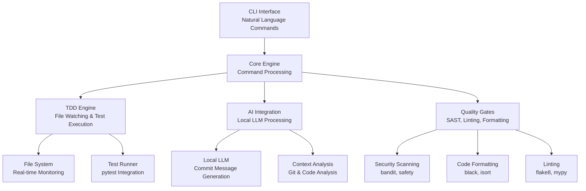
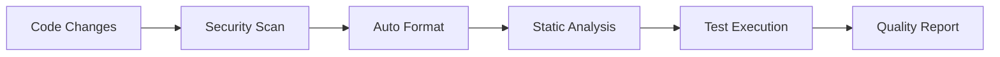

# poseidon-current: Technical Architecture

## System Overview

**poseidon-current** implements a modular, event-driven architecture optimized for development velocity and quality assurance. The service demonstrates enterprise-grade patterns through practical implementation.

## High-Level Architecture



## Component Architecture

### 1. CLI Interface Layer
**Responsibility**: Natural language command interpretation and user interaction

**Key Components**:

- **Command Parser**: Translates natural language to structured commands
- **Context Manager**: Maintains session state and user preferences
- **Output Formatter**: Provides consistent, readable feedback

**Technology Stack**:

- Click framework for command structure
- Rich library for enhanced terminal output
- Custom NLP processing for command interpretation

### 2. Core Engine
**Responsibility**: Central orchestration and workflow coordination

**Key Components**:

- **Workflow Orchestrator**: Manages multi-step development processes
- **Event Dispatcher**: Coordinates between components via event system
- **Configuration Manager**: Handles service configuration and preferences

**Design Patterns**:

- **Command Pattern**: Encapsulates operations as objects
- **Observer Pattern**: Event-driven component communication
- **Strategy Pattern**: Pluggable algorithms for different workflows

### 3. TDD Engine
**Responsibility**: Automated test-driven development workflows

**Key Components**:

- **File Watcher**: Real-time monitoring of source code changes
- **Test Selector**: Intelligent selection of relevant tests
- **Result Processor**: Analysis and reporting of test outcomes

**Implementation Details**:
```python
class TDDEngine:
    def __init__(self):
        self.file_watcher = FileWatcher()
        self.test_runner = TestRunner()
        self.result_processor = ResultProcessor()
    
    async def start_watching(self):
        async for event in self.file_watcher.watch():
            relevant_tests = self.select_tests(event.file_path)
            results = await self.test_runner.run(relevant_tests)
            self.result_processor.display(results)
```

### 4. AI Integration
**Responsibility**: Local LLM-powered development assistance

**Key Components**:

- **Model Manager**: Handles local LLM lifecycle and optimization
- **Context Builder**: Constructs prompts from git history and code analysis
- **Response Processor**: Formats AI output for development workflows

**Security Architecture**:

- **Local Processing**: No external API calls or data transmission
- **Sandboxed Execution**: Isolated model execution environment
- **Data Isolation**: Strict boundaries preventing data leakage

### 5. Quality Gates
**Responsibility**: Comprehensive code quality and security validation

**Key Components**:

- **Security Scanner**: SAST analysis using bandit and safety
- **Code Formatter**: Automated styling with black and isort
- **Linter**: Static analysis with flake8 and mypy

**Quality Pipeline**:


## Data Flow Architecture

### Development Workflow
1. **Developer Action**: Code modification or CLI command
2. **Event Generation**: File system or command event triggered
3. **Context Analysis**: Current state and change impact assessment
4. **Workflow Selection**: Appropriate response workflow chosen
5. **Parallel Execution**: Quality gates and tests run concurrently
6. **Result Aggregation**: Outcomes combined and formatted
7. **Feedback Delivery**: Results presented to developer

### AI-Assisted Commit Flow
1. **Git Analysis**: Repository state and uncommitted changes analyzed
2. **Context Building**: Code diff and commit history processed
3. **LLM Processing**: Local model generates commit message suggestions
4. **Quality Validation**: Generated messages validated for clarity and convention
5. **User Interaction**: Options presented for selection or modification

## Performance Architecture

### Optimization Strategies
- **Incremental Testing**: Only run tests affected by changes
- **Parallel Execution**: Concurrent quality gate processing
- **Caching**: Intelligent caching of test results and analysis
- **Resource Management**: Efficient CPU and memory utilization

### Scalability Considerations
- **Modular Design**: Components can be extracted and scaled independently
- **Event-Driven**: Loose coupling enables horizontal scaling
- **Resource Pools**: Shared resources for expensive operations (LLM, testing)

## Security Architecture

### Threat Model
- **Code Exposure**: Prevent proprietary code from leaving local environment
- **Dependency Vulnerabilities**: Continuous scanning of package dependencies
- **Input Validation**: Sanitization of all user inputs and file operations

### Security Controls
- **Local Processing**: All AI operations remain on local machine
- **Encrypted Storage**: Sensitive configuration encrypted at rest
- **Audit Logging**: Comprehensive logging of security-relevant operations
- **Principle of Least Privilege**: Minimal required permissions for all operations

## Monitoring & Observability

### Metrics Collection
- **Performance Metrics**: Test execution time, file processing latency
- **Quality Metrics**: Test coverage, security findings, code quality scores
- **Usage Metrics**: Command frequency, workflow patterns, error rates

### Health Monitoring
- **Component Health**: Real-time status of all service components
- **Resource Utilization**: CPU, memory, and disk usage tracking
- **Error Tracking**: Comprehensive error capture and analysis

---

**Architecture Principles**

- **Modularity**: Clear separation of concerns with well-defined interfaces
- **Testability**: Every component designed for comprehensive testing
- **Performance**: Sub-second feedback loops for development workflows
- **Security**: Security-by-design with multiple layers of protection
- **Maintainability**: Clean code patterns and comprehensive documentation