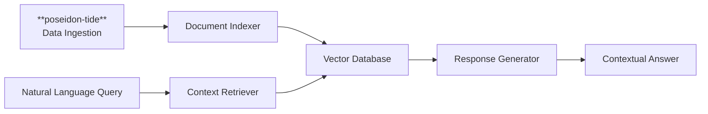

# **poseidon-oracle**: Knowledge Discovery & RAG

## Service Overview

**poseidon-oracle** provides intelligent knowledge discovery and retrieval across the entire Poseidon Platform, making all artifacts, configurations, deployments, and documentation instantly searchable through natural language queries.

## Data Flow Architecture

**poseidon-oracle** receives all platform knowledge through **poseidon-tide**'s data ingestion workflows, ensuring a clean, centralized data pipeline for knowledge indexing and retrieval.

## Core Capabilities

### Platform-Wide Indexing
- **Comprehensive Artifact Collection**: Receives processed data from **poseidon-tide** including code, configs, deployment manifests, logs, and documentation
- **Real-Time Updates**: Maintains fresh indexes as **poseidon-tide** ingests platform changes
- **Semantic Understanding**: Goes beyond keyword search with contextual comprehension

### RAG Implementation
- **Internal Vector Database**: Secure, on-premises knowledge storage
- **Contextual Retrieval**: Finds relevant information across service boundaries
- **Natural Language Interface**: Query platform knowledge conversationally

### Discovery Features
- **Cross-Service Search**: Find related configurations across multiple services
- **Deployment Traceability**: Track artifacts from development through production
- **Historical Analysis**: Search through platform evolution and changes

## Technical Architecture

### Knowledge Sources (via **poseidon-tide**)
- Service documentation and README files
- Configuration files and environment variables
- Deployment manifests and pipeline definitions
- Test results and coverage reports
- Monitoring data and alert definitions
- Architecture decision records (ADRs)

### RAG Pipeline

## Business Value

**Developer Productivity**

Instant access to platform knowledge without context switching

Rapid onboarding for new team members

Reduced time spent hunting for configuration details

**Operational Efficiency**

Quick troubleshooting through intelligent search

Cross-service impact analysis

Historical change tracking and reasoning

**Knowledge Preservation**

Institutional knowledge captured and searchable

Decision context preserved through ADR integration

Platform evolution documented automatically

## Example Queries

- "How do I configure TLS for **poseidon-harbor** deployments?"
- "What tests cover the AI commit message feature in **poseidon-current**?"
- "Show me all services that use Vault for secrets"
- "Why did we choose mTLS for service discovery in **poseidon-depths**?"
- "What changed in the **poseidon-forge** pipeline last month?"

## Integration Points

### Data Reception from **poseidon-tide**

- **Structured Data Feeds**: Receives processed artifacts from tide's ingestion workflows
- **Real-Time Streaming**: Continuous updates as tide processes platform changes
- **Metadata Enrichment**: Leverages tide's data quality validation and processing

### Query Interfaces

- **CLI Integration**: Search from command line tools
- **Web Interface**: Browser-based knowledge exploration
- **IDE Plugins**: In-editor contextual assistance
- **Slack/Teams Bots**: Conversational platform assistance

---

***poseidon-oracle*** transforms the Poseidon Platform into a self-documenting, discoverable ecosystem where knowledge is never lost and always accessible, powered by ***poseidon-tide's*** robust data ingestion capabilities.